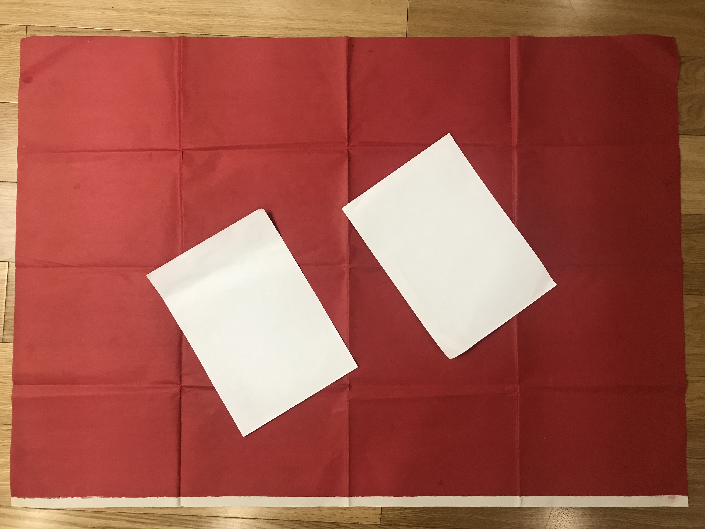

# edgelen

1. 简介

2. 获取背景坐标

   1. 原始图像

      

   2. 对背景设别

      使用颜色判断，目前只支持  红，蓝，绿，黄，白等基本颜色。

   3. 对背景进行聚类

      效果如图：

      为了减少内存占用，背景只处理指定数据的边框。

      聚类会产生多个聚族，选择像素点最多的聚族为背景图像。可以避免因光照产生散点的影响。

   4. 计算上下左右四角

      1. 将聚类后的背景按顺时针旋转45度，并获取最外侧像素

         

      2. 按上下左右四个点，将点划分为四个数组中，即四条边的点集合

      3. 对每条边所有点进行一元线性回归，即拟合出 y = kx +b 的直线，操作如下：

         a. 对点进行排序，先x后y

         b. 删除头尾1/4（可调）的像素点，头尾像素点识别错误的可能性最大

         c. 对剩下的点进行一元线性回归

      4. 解线性方法，计算出四条直线的交点。这四个交点就是新的上下左右四个点

      5. 

      6. 将四个点逆时针旋转45度

   5. 根据四个点建立投影矩阵

      1. 用户需要输入背景的真实长度和宽度
      2. ​

   6. ​

3. 获取图形边框

4. 计算边框长度