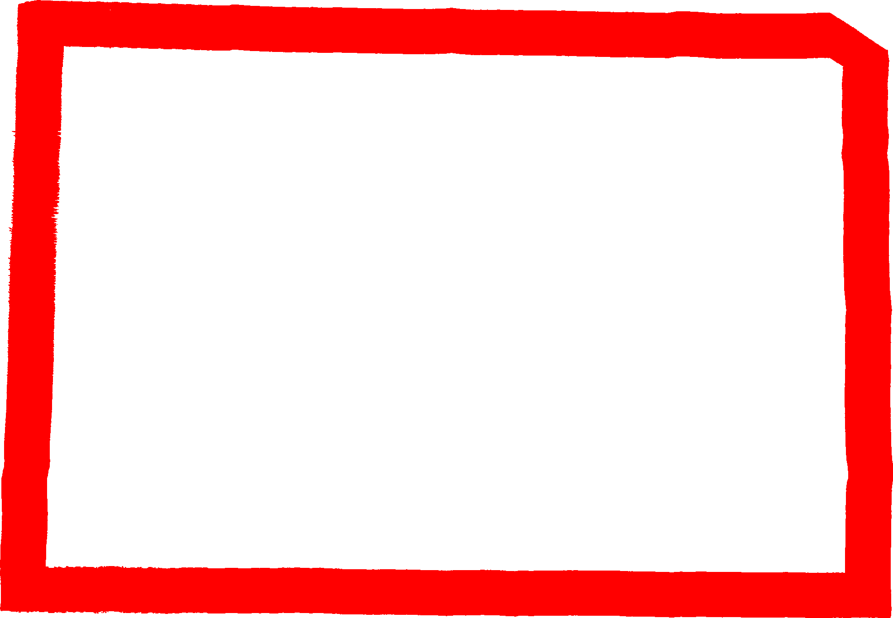

# 拍照计算边缘长

## 1 简介

## 2 实现思路

### 2.1  原始图像

原始图像查看：

[]: images/naive.jpg	"原始图像"

背景为一张红纸，需要识别出三张白纸的边长。

### 2.2 识别背景并建立坐标系统

#### 2.2.1 对背景设别

使用颜色判断，目前只支持  红，蓝，绿，黄，白等基本颜色。

这里背景为红纸，即红色

#### 2.2.2 对背景进行聚类

目前实现了层次聚类和密度聚类，目前密度聚类实现的速度和性能都优于层次聚类 ，但内存使用还有待优化。

聚类效果：

为了减少内存占用，背景只读取上下左右指定宽度的边框。

因为光照等原因，会有大量的错误象素，使得聚类会产生多个聚族，选择像素点最多的聚族为背景图像。实际情况中背景聚类拥有的象素点数量远远多于错误聚类的象素点。

#### 2.2.3 计算上下左右四角

1. 将聚类后的背景按顺时针旋转45度，并获取最外侧像素

   

2. 按上下左右四个点，将点划分为四个数组中，即四条边的点集合

3. 对每条边所有点进行一元线性回归，即拟合出 y = kx +b 的直线，操作如下：

   a. 对点进行排序，先x后y

   b. 删除头尾1/4（可调）的像素点，头尾像素点识别错误的可能性最大

   c. 对剩下的点进行一元线性回归

4. 解线性方法组，计算出四条直线的交点。这四个交点就是新的上下左右四个点

   

5. 将计算后四个点逆时针旋转45度，即原始点的坐标

#### 2.2.4 根据坐标点建立投影矩阵

1. 用户需要输入背景的真实长度和宽度

2. 目前没有考虑到透视情况。经过多次实验（从正上方，左上方，右上方等），当拍照角度不是特别倾斜的情况下，透视对最结果的影响极小。

3. 实际应用中只使用了三个点，取出 左上，右上，左下  三点

   ​

### 2.3 获取待测物边框

#### 2.3.1 对待测物进行识别

同背景识别一样，即对像素颜色进行判断。还需要判断像素点是否在背景区域内。

这里待测物为三张有规则或不规则白纸片，所以设置像素颜色为白色。

目前要求待测物的颜色是一样。

#### 2.3.2 聚类

同背景聚类一样，可以使用密度聚类或层次聚类。

考虑到图形的不规则性，聚类待测图片里，不能只取边缘像素。

聚类后的效果：

#### 2.3.3 识别边框

对每个聚类后图形进行Laplace滤波，识别图形的边框。

下图为对第三个图形识别出来的边框

#### 2.3.4 将图形边缘点生成多段线

1. ​

### 2.4 计算边框长度

## 3 用到的一些算法

### 3.1 聚类

1. 层次聚类
2. 密度聚类

### 3.2 一元线性回归

### 3.3 多段线生成

### 3.4 滤波

高斯滤波

Laplace滤波

### 3.5 插值

B样条插值

### 3.6 矩阵计算

旋转

投影

## 4 样例