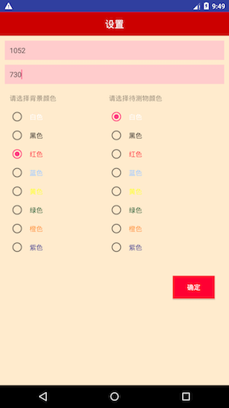
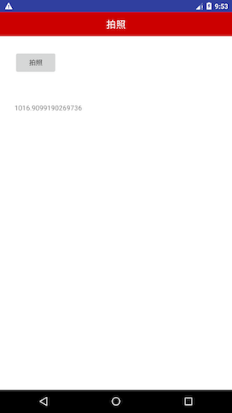
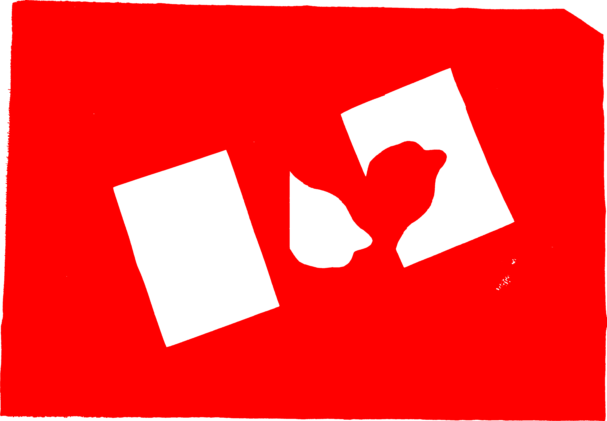
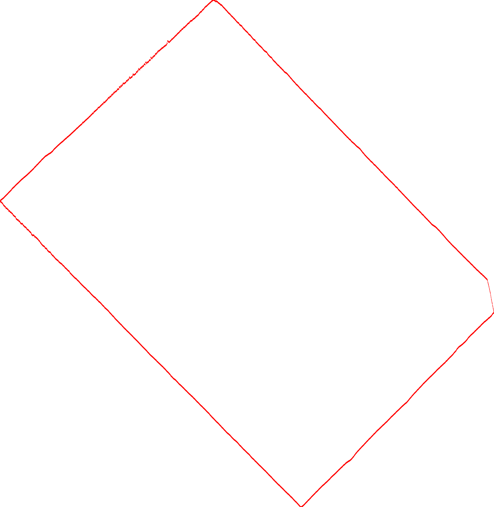
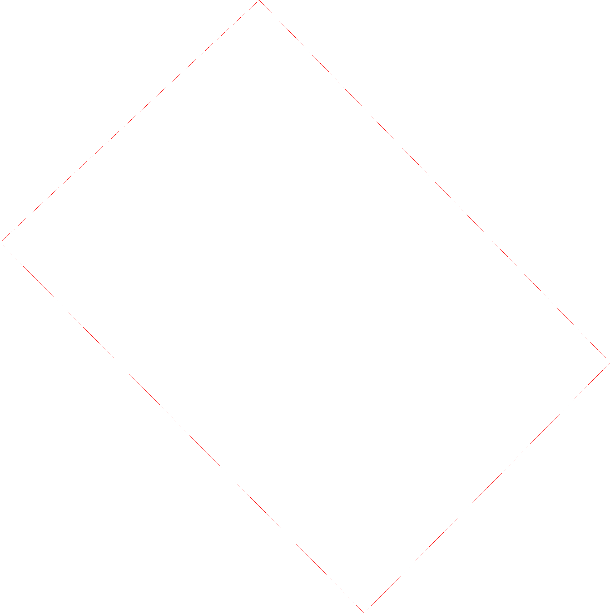
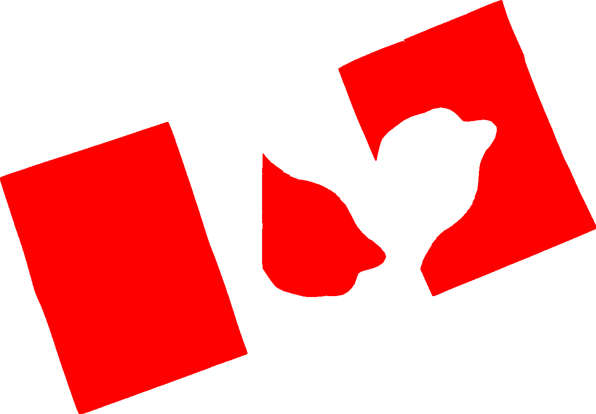
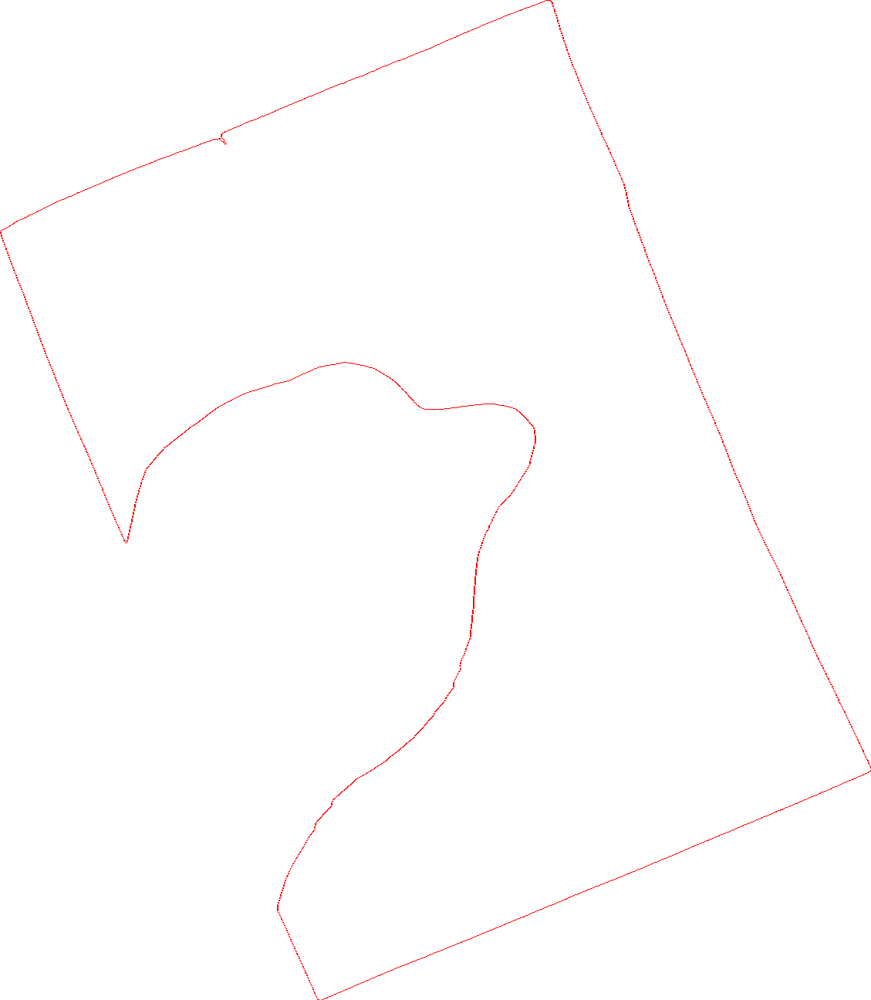

# 不规则图形的轮廓识别及其周长计算

## 1 简介

edgelen是一个对图片中不规则图形的轮廓进行识别并计算其周长的java程序，纯Java实现。用到的算法有：

​	Kmeans

​	混合高斯模型

​        层次聚类

​	密度聚类

​	线程回归

​	高斯滤波，拉普拉斯滤波

​	B样条插值

其中：

​	Kmeans和GMM都用于识别前景色和背景色

​	层次聚类和密码都用于形状识别

​	滤波用于平滑及获取物体边缘

​	B样条插值用于计算长度

该库可以在任何支持Java的程序中使用。比如可以封装在Android APP中。



分别在输入框中输入背景的长与宽，选择背景的颜色，待测物的颜色，点确定，进入如下页面



选择拍照，拍照确定后，会显示相应的长度。


edgelen是根据待测物在参考背景中的位置关系以及参考背景的尺寸（长宽），计算出待测物的周长。


## 2 实现思路

### 2.1  整体思路

下面讲述实现思路时，将以该图片为例子进行描述。


原始图像查看：https://github.com/changhaili/edgelen/blob/master/images/naive.JPG

[原始图像]: https://github.com/changhaili/edgelen/blob/master/images/naive.JPG

参考为红底白纸，即背景为一张红纸，本示例需要识别出三张白纸的周长。

1. 识别背景色及前景色
   - 去除图片的上下左右边缘，随机采样出部分像素点
   - 使用聚类根据像素点颜色值 将颜色聚成两类
   - 计算两个类簇的方差，方差为大者所对应的颜色为背景色（本例为红色），小者为前色（本例为白色）
2. 背景处理及坐标生成
   - 使用颜色聚类的结果读取所有背景色（红色）的像素点
   - 对红包像素点进行聚类，将 聚类后的簇 按包含的像素点数量倒序，只第一个簇为背景 
   - 将背景顺时针旋转45度
   - 取出最外侧像素点，并分成四组，最原始背景的左侧边，上侧边，右侧边，下侧边
   - 将各边回归出一条直接，分别得到四条直线
   - 求四条直接的交点，即可以获取  上下左右 四个控制点
   - 将四个控制点逆时针旋转45度
   - 根据四个控制 点生成投影坐标
3. 待测图形的边缘设别及曲线生成
   - 将待测图形进行聚类
   - 根据输入的待测图形的数量返回聚类后的 簇
   - 将 聚类后的像素点进行 Laplace平滑，并获取边缘像素点
   - 使用方位角游走的方式，将边缘像素点生成多线数（曲线）
4. 曲线长度计算
   - 曲线上的像素点进行 滤波，可以使用高斯滤波或平均滤波
   - 对像素点进行多次采样
   - 对像素点使用B样条插值
   - 微分B曲线并计算 欧式距离
   - 加权平均多次采样结果，即为周长


如上例中，红纸的长宽为：1052 * 730； 单位为毫米，手工软布尺测量，稍有误差。

最后识别出三张白纸的周长分别为：1015.7，519.2，1255.9 。 手工软布尺测量1015.5-， 518.5-，1254.5+，误差小于 0.2 %

也可进行如下精度推理：

1. 考虑到A4 大小标准为 297* 210， 即周长为 1014，误差小于0.2%。

2. 右侧两个图形是由一张A4纸剪出，则可以中间图形的周长推导出右侧图形的周长：

   中间白纸规则部分（即图形的左侧垂边，A4纸边）长度为139，则不规则部分为 519.2-139 = 380.2

   最右侧图形的周长可以计算出：1014 -139 + 380.2 = 1255.2 

   误差也小于 0.2%


当每隔一像素采样取点时，结果计算为1016.9， 519.2，1251.7，误差小于0.4%，运行速度得到了提升。


### 2.2 识别背景并建立坐标系统

#### 2.2.1 对背景设别

使用颜色聚类识别出背景色和前景色


#### 2.2.2 对背景进行聚类

目前实现了层次聚类和密度聚类，目前密度聚类实现的速度和性能都优于层次聚类 ，但内存使用还有待优化。

聚类后效果如下：




实际应该中，为了减少内存使用，背景可以读取上下左右指定宽度的像素点。


因为光照等原因，会有大量的错误象素点，使得聚类会产生多个聚族，选择像素点最多的聚族为背景图像。实际情况中背景聚类拥有的象素点数量远远多于错误聚类的象素点。


#### 2.2.3 计算上下左右四角

1. 将聚类后的背景（只剩下部分边框）按顺时针旋转45度，并获取最外侧像素

   

2. 按上下左右四个点，将点划分为四个数组中，即可形成 上下左右 四条边的点集合

3. 对每条边所有点进行一元线性回归，即拟合出 y = kx +b 的直线，操作如下：

   a. 对点进行排序，先x后y；

   b. 删除 首尾 1/4（可调）的像素点，首尾像素点识别错误的可能性很大，如该图中缺只角；

   c. 对剩下的点进行一元线性回归。

4. 解四个二元线性方程组，计算出四条直线的交点。这四个交点就是新的上下左右四个点坐标

   

5. 将计算后四个点逆时针旋转45度，即原始点的坐标

#### 2.2.4 根据坐标点建立投影矩阵

1. 用户需要输入背景的真实长度和宽度

2. 目前没有考虑到透视情况。经过多次实验（从正上方，左上方，右上方等），当拍照角度不是特别倾斜的情况下，透视对最结果的影响极小。

3. 实际应用中只使用了三个点，取出 左上，右上，左下  三点

   ​

### 2.3 获取待测物边界并连成多段线

#### 2.3.1 对待测物进行识别

同背景识别一样，即对像素颜色进行判断。还需要判断像素点是否在背景区域内。

这里待测物为三张有规则或不规则白纸片，所以设置像素颜色为白色。

目前要求待测物的颜色是一样。


#### 2.3.2 待测物体聚类

同背景聚类一样，可以使用密度聚类或层次聚类。

考虑到图形的不规则性，聚类待测图片里，不能只取边缘像素。

聚类后的效果：



#### 2.3.3 识别边界

对每个聚类后图形进行Laplace滤波，识别图形的边界。

下图为对第三个图形识别出来的边界：



#### 2.3.4 将图形边缘点生成多段线

使用方位角的游走来实现。一个聚类中可以生成多条多段线，取像素点最多的进行返回。

实现在后面详述


### 2.4 计算多段线长度

使用B样条插值：

1. 使用滤波，过滤掉锯齿。测试高斯滤波，平均滤波对结果影响极小

2. 对点进行采样，分别隔0，1，…，9个点进行采样

   对采样后的点进行样条插值

   两点间插入20（可调）个中间点

   计算两点间欧式距离

   累积所的的距离和，即结果

3. 进所有结果进行加权平均即 多段线长度


## 3 用到的一些算法

### 3.1 聚类

#### 3.1.1 Kmeans聚类

用于区分前景色与背景色

过程：

1. 去掉原始图像的边缘部分，随机采样出部分像素点
2. 将像素点的颜色组成(R,G,B)的向量，所有的像素点组织成 3*N的矩阵
3. 归一化颜色矩阵
4. 计算颜色矩阵协方差矩阵，并计算PCA，并比例占90%以上的分量
5. 将降维后的颜色矩阵使用Kmeans进行聚类，其中k=2
6. 计算聚类的方差，如果方差大，则该类为背景色，方差小，则为前景色

使用PCA的原因：颜色RGB值存在线性相关，如红色的RGB为(255, 0, 0)，白色为(255, 255,255)， 即绿色成分与蓝色成分线性相关

比如方差有一个假设：背景比图形分布更散

#### 3.1.2 GMM聚类

用于区分前景色与背景色

过程：

1. 采样像素颜色值及相关的降维处理同上
2. 将降维后的颜色矩阵使用GMM进行聚类 ，其中k=2
3. 循环所有的所有的像素点（降维后）判断该点占某一聚类的概率，并将该像素点划为概率值最大所在的类别 
4. 之后也是根据方差判断颜色

#### 3.1.3 层次聚类

用于识别出图形。

过程：

1. 分解阶段

   a. 按长方形划分区域

   b. 如果当时区域内所有像素点都为前景色，同判断为一个 簇

   ​    如果当时区域内所有像素点都为非前景色，同舍弃该区域

   ​    如果当时区域内的像素点即有前景色又有非前景色，则按 左上，右上，左下，右下，四个区域继续划分区域

   c. 重复a, b 过程


2. 归并阶段

   采用类似于最短路径算法实现

   将所有的  簇 做为定义图的顶点，如果两个簇相邻，则距离为1， 否则距离为无穷

   可以使用Dijkstra， floyd等算法记录两个簇之间的路径，只要路径不为无穷，则它们可以划为同一 簇

   归并过程递归呀循环实现

#### 3.1.4 密度聚类

用于识别出图形。

定义所有点都为核心对象，相邻的像素为密度直达。

过程比较简单：

1. 循环所有像素点，找出它密度直达的像素点
2. 通过密度直达的像素点找到所有密度可达的像素点，并将其加入到集合中
3. 循环1，2过程，返回聚类像素点的集合

### 3.2 一元线性回归

### 3.3 多段线生成

方法如下：

1. 计算重心

2. 任取一个像素计算该像素到重心的方位角

3. 计算像素附近的其他像素点到重点的方位角

4. 选择一个方向一致且方位角之差最小的像素做为后续点

5. 循环2-4步，直到回到最初的像素点，则成环

   或附近没有像素点，放弃该多段线

6. 重复2-5步，直到处理像素点

7. 取最长的多段线（应该取围成面积最大的多线段，但没有实现）

### 3.4 滤波

高斯滤波

Laplace滤波

### 3.5 插值

B样条插值

### 3.6 矩阵计算

旋转

投影


## 4 示例代码


Maven配置了是使用Java 1.7，一些1.8的新特性无法使用

以下代码在 GirthTest.java 文件中，可以指定一张新图片，运行该测试用用例


```java
// 运行时，下面四行赋值需要修改

String imgPath = "/Users/lichanghai/Mine/edgelen/images/naive.jpg";
    
SupportColor backColor = SupportColor.Red;
SupportColor foreColor = SupportColor.White;
int clusterCount = 3;

final BufferedImage img = ImageIO.read(new File(imgPath));

final int width = img.getWidth();
final int height = img.getHeight();

final int[] pixels = new int[width * height];
img.getRGB(0, 0, img.getWidth(), img.getHeight(), pixels, 0, width);

ImagePixelHolder pixelHolder = new ImagePixelHolder(1, new PixelImage() {

  @Override
  public int getWidth() {
    return width;
  }

  @Override
  public int getHeight() {
    return height;
  }

  @Override
  public int getColor(int x, int y) {
    return pixels[y * width+x];
  }
});

EdgeCurve[] curves  = LatticeUtils.getEdgeCurves(pixelHolder, 1052, 730,
                                                 backColor, foreColor, clusterCount, false);

for (EdgeCurve curve : curves) {

  GirthResult result = curve.getGirth();

  System.out.println("default : " + result.getRecommender());

  for (double d : result.getOthers()) {
    System.out.println("other girth : " + d);
  }
}
```


## 5 一些问题

### 5.1 透视引起的精度问题

1. 目前没有考虑透视影响。为了实现方面，该项目本质是只是在平面上进行处理。透视需要考虑到三维空间的问题，比较麻烦。
2. 只要不是手机放得过于倾斜，透视带来的影响很小，几乎可以忽略。

### 5.2 不要旋转45度拍摄

# <font color=red >欢迎Star, 欢迎Fork</font>

