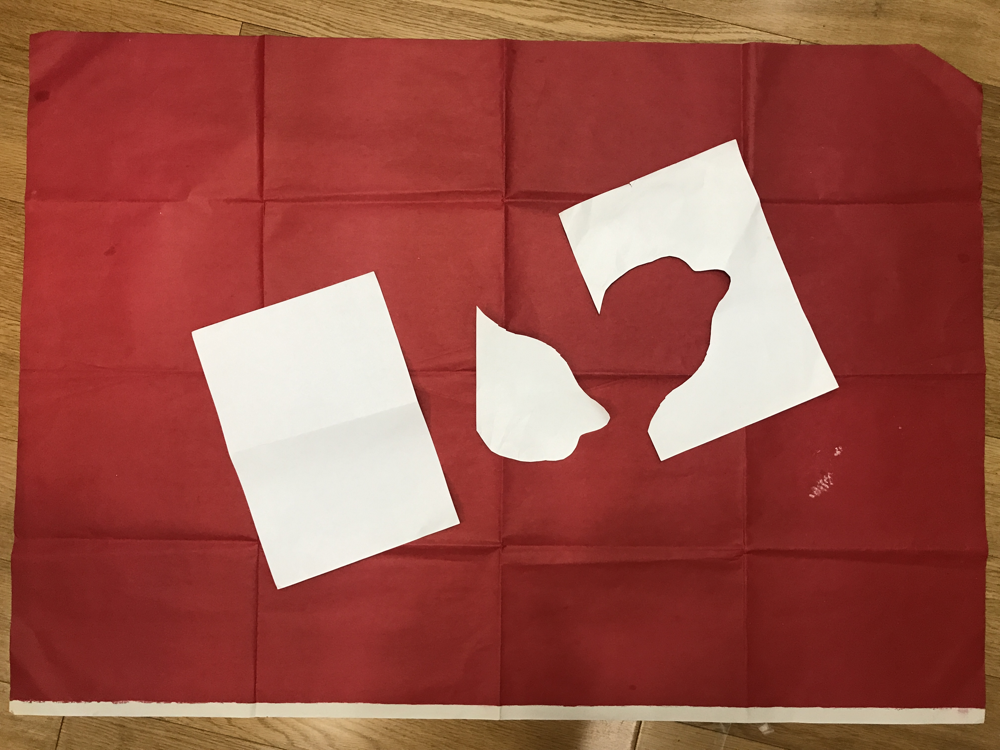

# edgelen

# 简介

# 实现方案

1. 原始图像

   

   背景为一张红纸

   需要识别出三张白纸的边长

   ​

2. 识别背景并建立坐标系统

   1. 对背景设别

      使用颜色判断，目前只支持  红，蓝，绿，黄，白等基本颜色。

      这里背景为红纸，即红色

   2. 对背景进行聚类

      聚类效果：

      为了减少内存占用，背景只读取上下左右指定宽度的边框。

      聚类会产生多个聚族，选择像素点最多的聚族为背景图像。可以避免因光照产生散点的影响。

   3. 计算上下左右四角

      1. 将聚类后的背景按顺时针旋转45度，并获取最外侧像素

         

      2. 按上下左右四个点，将点划分为四个数组中，即四条边的点集合

      3. 对每条边所有点进行一元线性回归，即拟合出 y = kx +b 的直线，操作如下：

         a. 对点进行排序，先x后y

         b. 删除头尾1/4（可调）的像素点，头尾像素点识别错误的可能性最大

         c. 对剩下的点进行一元线性回归

      4. 解线性方法，计算出四条直线的交点。这四个交点就是新的上下左右四个点

         

      5. 将四个点逆时针旋转45度

   4. 根据四个点建立投影矩阵

      1. 用户需要输入背景的真实长度和宽度
      2. 目前没有考虑到透视情况。经过多次实验（从正上方，左上方，右上方等），当拍照角度不是特别倾斜的情况下，透视对最结果的影响极小。
      3. 实际应用中只使用了三个点，取出 左上，右上，左下  三点

3. 获取图形边框

   1. 对图形进行识别

      同背景识别一样，即对像素颜色进行判断。还需要判断像素点是否在背景区域内。

   2. 聚类

   3. 识别边框

      使用Laplace滤波

   4. 将图形边缘 散点 拼装 多段线

4. 计算边框长度

# 用到的一些算法

## 聚类

1. 层次聚类
2. 密度聚类

## 一元线性回归

## 多段线生成

## 滤波

高斯滤波

Laplace滤波

## 插值

B样条插值

## 矩阵计算

旋转

投影